DeepPanel 
==================

Python project used to implement **comic vignettes segmentation using a machine learning method named deep learning**.

DeepPanel let's you extract all the panels' location from a comic page **using a machine learning model trained in this repository. This project does not use Open CV but a deep learning model designed for image segmentation based on a [convolutional neural network named U-Net](https://en.wikipedia.org/wiki/U-Net). We've optimized our model in terms of size and performance for mobile applications.** Powered by [TensorFlow](https://www.tensorflow.org), DeepPanel is able to find all the panels' location in less than a second. 

You can find this model's application for Android and iOS in these GitHub repositories:

* [DeepPanel for Android](https://github.com/pedrovgs/DeepPanelAndroid).
* [DeepPanel for iOS](https://github.com/pedrovgs/DeepPaneliOS).


Keep in mind, **this artificial intelligence solution is designed to simulate the human reading behavior and it will group panels that are related as a human would do while reading a comic book page.** When analyzing a page we do not use image processing algorithms in order to find the panels. Our solution is based on deep learning. We do not use contour detection algorithms at all even when the samples analysis can look similar. If you are looking for a panels contouring solution you can use Open CV or any other image analysis tools like [this project](https://github.com/njean42/kumiko) does.

| Original        | Analyzed           |
| ----------------|--------------------|
|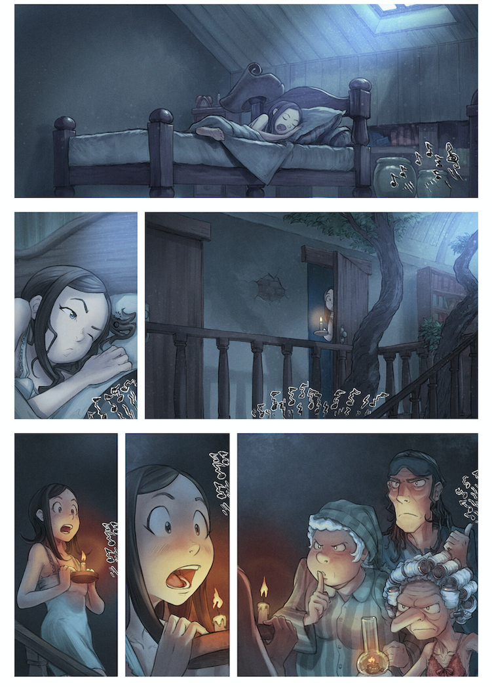|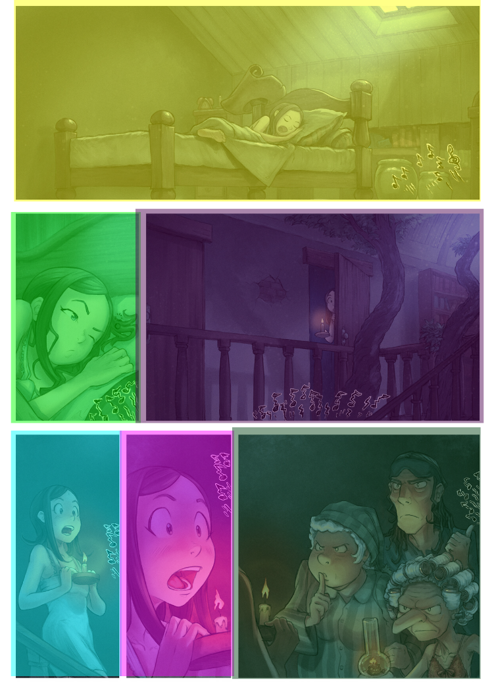|
|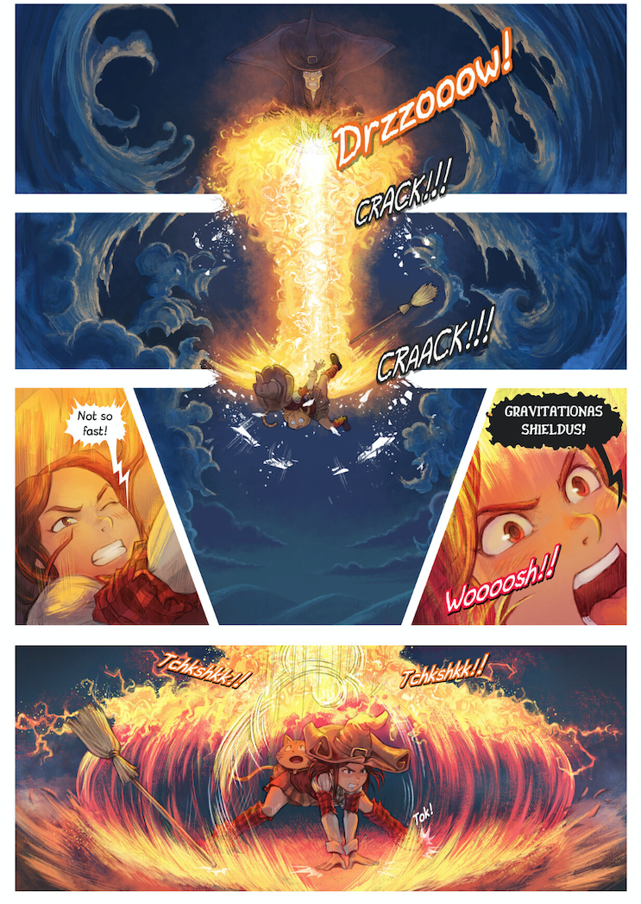|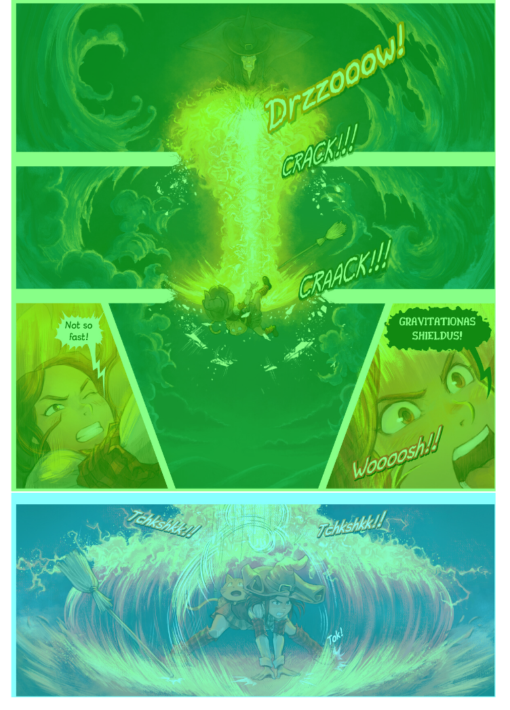|

All the pages used in our sample project are created by [Peper & Carrot](https://www.peppercarrot.com) which is a free comic book you should read right now :heart:

## How to use DeepPanel

1. [Install Python 3.7](https://www.python.org/downloads/release/python-377/).
2. If you are a OSX user remeber to execute the script ``Install Certificates`` you'll find inside the ``Applications/Python3`` installation folder
3. [Install pip](https://pip.pypa.io/en/stable/installing/)
4. Install pipenv: ``pip3 install pipenv``
5. Install graphviz with this command: ``brew install graphviz`` or ``apt-get install graphviz``.
6. Create your pipenv enviornment: ``pipenv install``
7. Start pipenv environment: ``pipenv shell``
8. Execute any of the scripts ready to use: 

* ``python DeepPanel.py``: Trains the model saves a file with the result.
* ``python DeepPanelMobile.py``: Exports the already trained model for the mobile libraries.
* ``python DeepPanelTest.py``: Using the already trained and saved model analyzes some pages and saves the results.

## Dataset

Keep in mind you'll have to create your own dataset before training the model. We provide some images as an example but the real dataset used to train the model used in our Android and iOS libraries is not provided. Inside the dataset folder you'll find two folders where you should place your raw pages and the pages you've already analyzed. Remember this is a supervised model and you'll need to create your own dataset to be able to train it.

```
dataset
 | - test
 | ----| - raw
 | ----| - segmentation_mask
 | - training
 | ----| - raw
 | ----| - segmentation_mask
``` 

Images in ``raw`` folders will be ``.jpg`` images. Images inside the ``segmentation_mask`` folder will use a ``.png`` format without alpha, compression, or optimizations. Inside should place pixes with three colors:

* Full RGB blue for background.
* Full RGB red for border.
* Full RGB green for panel content.

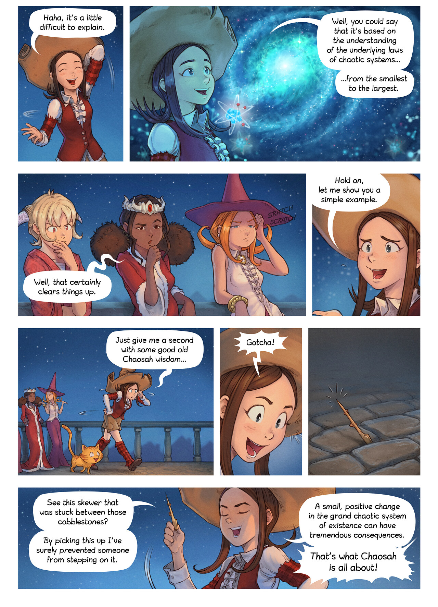
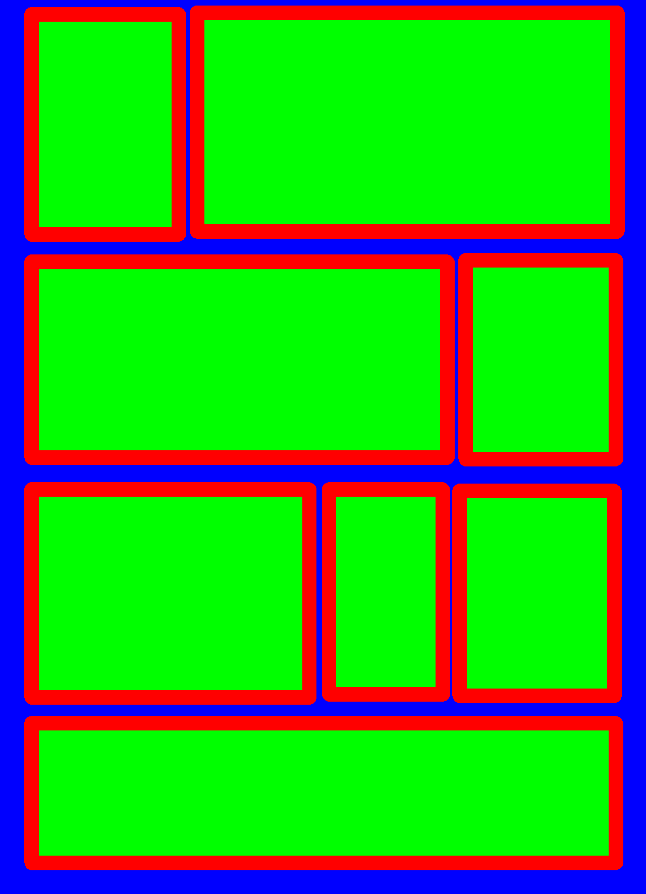

Raw pages and masked pages have to use the same name in different folders.

## Model performance

These are the metrics collected during the model training with our private dataset composed by:
 
 * 550 pages for our training dataset.
 * 83 pages for our testing dataset. 

### Accuracy

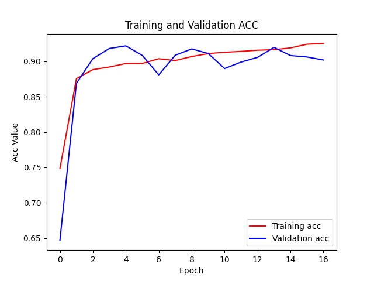

### Accuracy per label

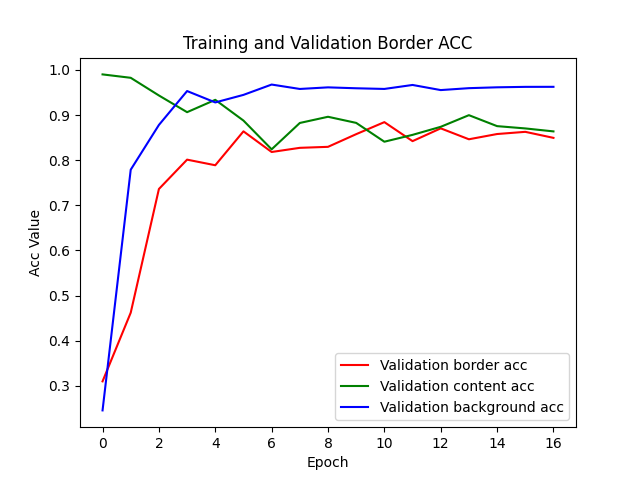
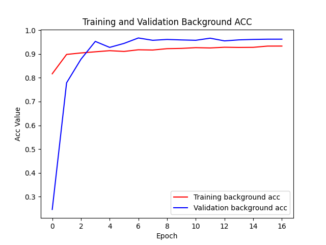
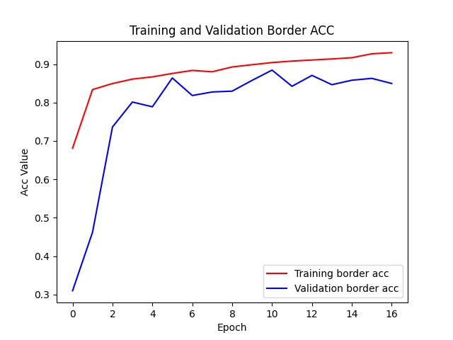
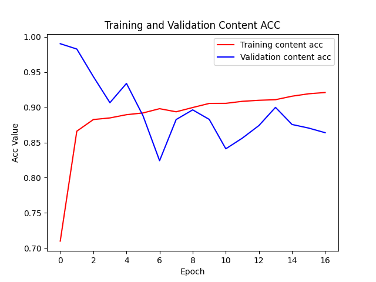

### Loss

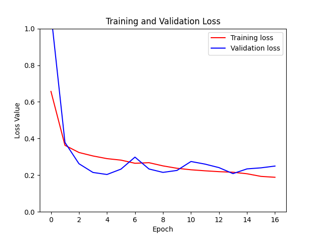

### Do you want to contribute?

Feel free to contribute, we will be glad to improve this project with your help. Keep in mind that your PRs must be validated by Travis-CI before being reviewed by any core contributor.

### Acknowledgement

Special thanks to [Asun](https://github.com/asuncionjc), who never doubt we could publish this project :heart:

Developed By
------------

* Pedro Vicente Gómez Sánchez - <pedrovicente.gomez@gmail.com>

<a href="https://x.com/pedro_g_s">
  
</a>
<a href="https://es.linkedin.com/in/pedrovgs">
  
</a>

License
-------

    Copyright 2020 Pedro Vicente Gómez Sánchez

    Licensed under the Apache License, Version 2.0 (the "License");
    you may not use this file except in compliance with the License.
    You may obtain a copy of the License at

       http://www.apache.org/licenses/LICENSE-2.0

    Unless required by applicable law or agreed to in writing, software
    distributed under the License is distributed on an "AS IS" BASIS,
    WITHOUT WARRANTIES OR CONDITIONS OF ANY KIND, either express or implied.
    See the License for the specific language governing permissions and
    limitations under the License.