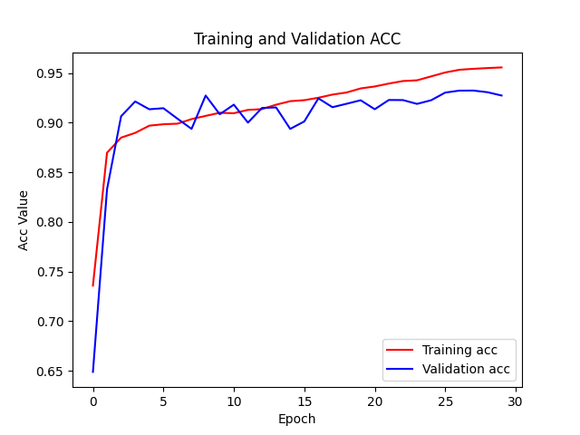
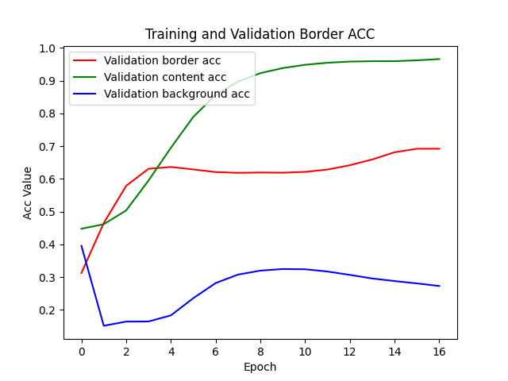
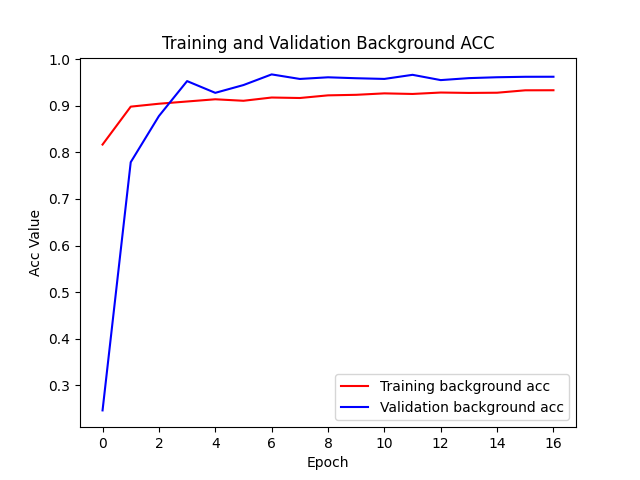
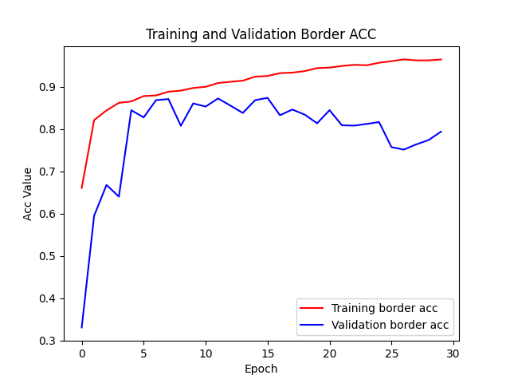
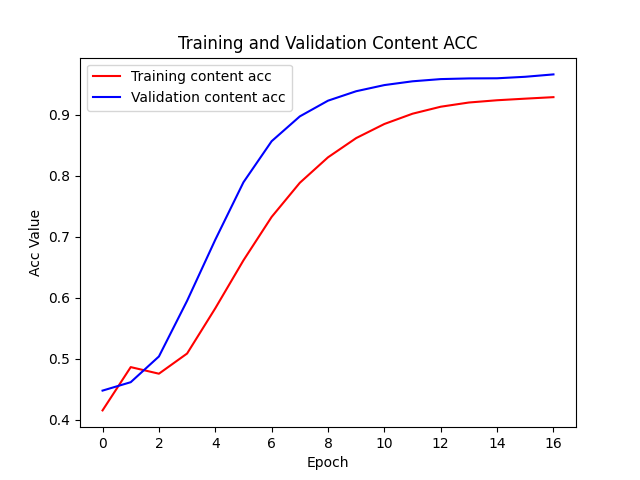
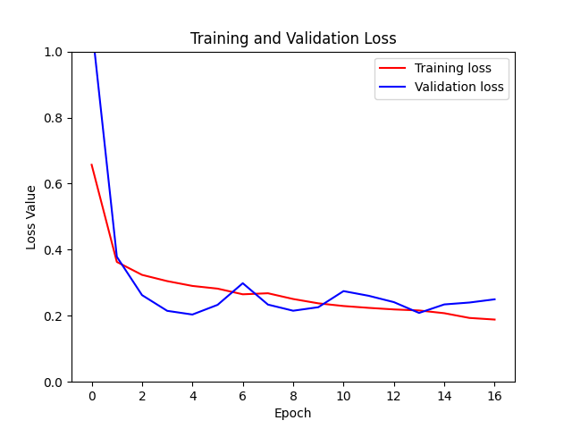

DeepPanel 
==================

Finding a panel inside a comic page is the hardest thing I've ever done in computer science!

* Steps to use DeepPanel

1. [Install Python 3.7](https://www.python.org/downloads/release/python-377/).
2. If you are a OSX user remeber to execute the script ``Install Certificates`` you'll find inside the ``Applications/Python3`` installation folder
3. [Install pip](https://pip.pypa.io/en/stable/installing/)
4. Install pipenv: ``pip3 install pipenv``
5. Install graphviz with this command: ``brew install graphviz`` or ``apt-get install graphviz``.
6. Create your pipenv enviornment: ``pipenv install``
7. Start pipenv environment: ``pipenv shell``
8. Execute the main script: ``python DeepPanel.py``

## Model performance

These are the metrics collected during the model training for the testing and training datasets:

### Accuracy

### Accuracy per label

### Loss

